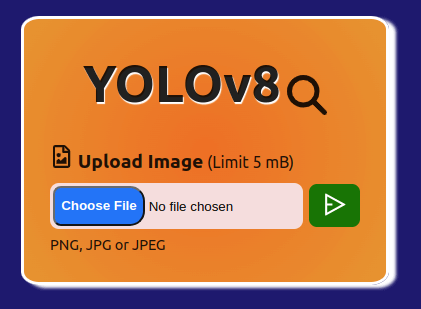
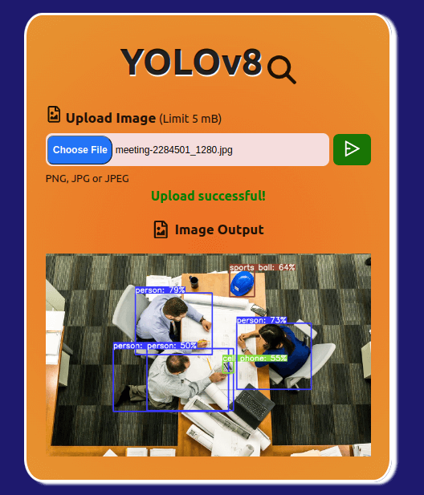

## Setup

### Backend
#### FastAPI

- `cd backend`
  
- `virtualenv myenv`

- `source myenv/bin/activate`

- `python3 -m pip install -r requirements.txt`

##### Run

- `cd objectDetectionAPI`

- `uvicorn main:app --reload`

### Frontend 
#### React and Run

- `cd frontend`

- `npm install`
  
- `npm run dev`

## Images

- Main web page.
  

    
  

- After sending an image.
  

    
  

